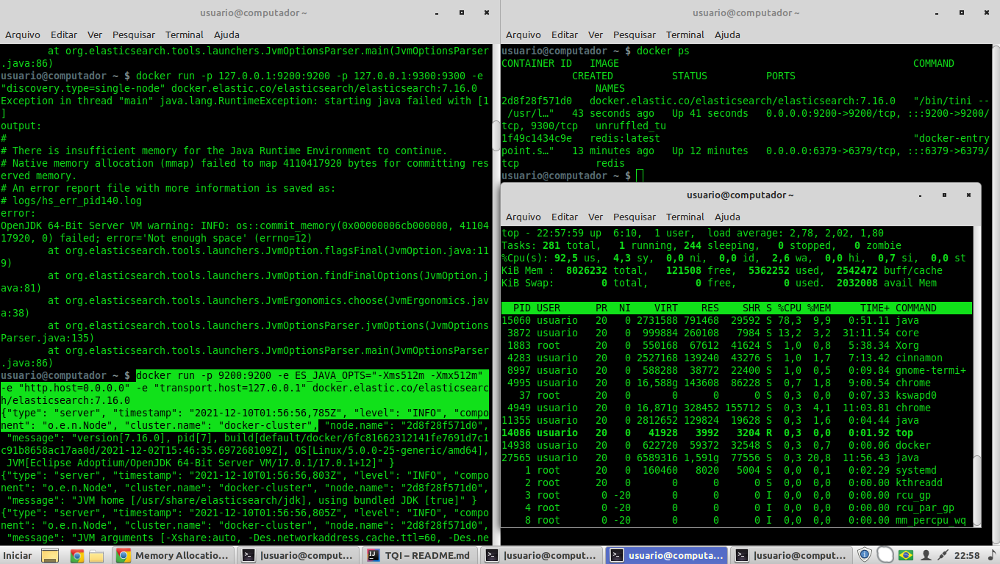

# Java Microservice Application using ElasticSearch Spring Cloud - 
### O projeto não é requisito para conclusão mas é parte fundamental do Bootcamp TQI na Digital Innovation One

## Stack 

  * Java8
  * Spring Cloud
  * Spring ElasticSearch Data
  * ElasticSearch
  * Junit
  * Mockito
  * sl4j
  * Docker
  * Redis
  
### Code Quality
* SonarLint

### Tests
* Postman
  * https://web.postman.co/workspace/My-Workspace~728c0cf1-f562-47b6-8f38-800bcfb65bad
*
* Tutorial de testes:
  * +https://www.callicoder.com/spring-5-reactive-webclient-webtestclient-examples/

### API Documentation

https://app.swaggerhub.com/apis-docs/edabruzzo/default-title/0.1


http://localhost:8080/webjars/swagger-ui/index.html?configUrl=/v3/api-docs/swagger-config


### Commands
#### Installing and running ElasticSearch docker image locally 

    Obtaining Elasticsearch for Docker is as simple as issuing a docker pull command against the Elastic Docker registry.
```
docker pull docker.elastic.co/elasticsearch/elasticsearch:7.16.0
```
    Starting a single node cluster with Dockeredit
    To start a single-node Elasticsearch cluster for development or testing, specify single-node discovery to bypass the bootstrap checks:
```
docker run -p 127.0.0.1:9200:9200 -p 127.0.0.1:9300:9300 -e "discovery.type=single-node" docker.elastic.co/elasticsearch/elasticsearch:7.16.0
```
+ https://www.elastic.co/guide/en/elasticsearch/reference/current/docker.html

#### Problema de memória alocada insuficiente para o Docker rodar 2 instâncias do Redis 

    

```
usuario@computador ~ $ docker run -p 127.0.0.1:9200:9200 -p 127.0.0.1:9300:9300 -e "discovery.type=single-node" docker.elastic.co/elasticsearch/elasticsearch:7.16.0
Exception in thread "main" java.lang.RuntimeException: starting java failed with [1]
output:
#
# There is insufficient memory for the Java Runtime Environment to continue.
# Native memory allocation (mmap) failed to map 4110417920 bytes for committing reserved memory.
# An error report file with more information is saved as:
# logs/hs_err_pid140.log
error:
OpenJDK 64-Bit Server VM warning: INFO: os::commit_memory(0x00000006cb000000, 4110417920, 0) failed; error='Not enough space' (errno=12)
	at org.elasticsearch.tools.launchers.JvmOption.flagsFinal(JvmOption.java:119)
	at org.elasticsearch.tools.launchers.JvmOption.findFinalOptions(JvmOption.java:81)
	at org.elasticsearch.tools.launchers.JvmErgonomics.choose(JvmErgonomics.java:38)
	at org.elasticsearch.tools.launchers.JvmOptionsParser.jvmOptions(JvmOptionsParser.java:135)
	at org.elasticsearch.tools.launchers.JvmOptionsParser.main(JvmOptionsParser.java:86)


```


    **Workaround**
    
    docker run -p 127.0.0.1:9200:9200 -e ES_JAVA_OPTS="-Xms512m -Xmx512m" -e "http.host=0.0.0.0" -e "transport.host=127.0.0.1" docker.elastic.co/elasticsearch/elasticsearch:7.16.0

    usuario@computador ~ $ docker run -p 9200:9200 -e ES_JAVA_OPTS="-Xms512m -Xmx512m" -e "http.host=0.0.0.0" -e "transport.host=127.0.0.1" docker.elastic.co/elasticsearch/elasticsearch:7.16.0
    
    {"type": "server", "timestamp": "2021-12-10T01:56:56,785Z", "level": "INFO", "component": "o.e.n.Node", "cluster.name": "docker-cluster", "node.name": "2d8f28f571d0", "message": "version[7.16.0], pid[7], build[default/docker/6fc81662312141fe7691d7c1c91b8658ac17aa0d/2021-12-02T15:46:35.697268109Z], OS[Linux/5.0.0-25-generic/amd64], JVM[Eclipse Adoptium/OpenJDK 64-Bit Server VM/17.0.1/17.0.1+12]" }
    {"type": "serv  .....)

    If you don’t want to expose port 9200 and instead use a reverse proxy, replace 9200:9200 with 127.0.0.1:9200:9200 in the docker-compose.yml file. Elasticsearch will then only be accessible from the host machine itself.

```shell
curl -X GET "localhost:9200/_cat/nodes?v=true&pretty"

usuario@computador ~ $ curl http://localhost:8080/actuator/health

{"status":"UP"}

usuario@computador ~ $ curl -X GET "localhost:9200/_cat/nodes?v=true&pretty"
ip        heap.percent ram.percent cpu load_1m load_5m load_15m node.role   master name
127.0.0.1           23          97  54    1.86    1.45     1.66 cdfhilmrstw *   

```

+ https://github.com/elastic/elasticsearch-docker/issues/43
    


#### Criando shell script para start da imagem 
    
    
    $ docker pull docker.elastic.co/elasticsearch/elasticsearch:7.16.0
    7.16.0: Pulling from elasticsearch/elasticsearch
    da847062c6f6: Pull complete
    80e4b6288255: Pull complete
    469908321dea: Pull complete
    0b88c72488a1: Pull complete
    d303173f22c5: Pull complete
    5759d6bc2a4c: Pull complete
    c706099639be: Pull complete
    23e9abf3b265: Pull complete
    Digest: sha256:2cdefcb9754028f0b2c860cf9ec52be15c026f3aa23c22ec181e321c427aadc7
    Status: Downloaded newer image for docker.elastic.co/elasticsearch/elasticsearch:7.16.0
    docker.elastic.co/elasticsearch/elasticsearch:7.16.0


    $ echo """docker run -d --name elasticsearch -p 9200:9200 -p 9300:9300 -e "discovery.type=single-node" elasticsearch:latest""" >> run-elasticsearch.sh
    $ chmod +x run-elasticsearch.sh
    $ sh run-elasticsearch.sh


#### Installing and running Redis docker image locally
    
      $ echo "sudo docker run --name redis -p 6379:6379 -d redis:latest" >> run-redis.sh
      $ sh run-redis.sh
 
      Unable to find image 'redis:latest' locally
      latest: Pulling from library/redis
      e5ae68f74026: Pull complete
      37c4354629da: Pull complete
      b065b1b1fa0f: Pull complete
      6954d19bb2e5: Pull complete
      6333f8baaf7c: Pull complete
      f9772c8a44e7: Pull complete
      Digest: sha256:2f502d27c3e9b54295f1c591b3970340d02f8a5824402c8179dcd20d4076b796
      Status: Downloaded newer image for redis:latest
      5c42b29b6057cd4e9bd602372caf0a2664c18036f42cada1a0373c884f491a48

+ https://hub.docker.com/_/redis

### Spring Actuator

#### Health's application verification
    usuario@computador ~ $ curl http://localhost:8080/actuator/health
    {"status":"UP"}
    
        
    2021-12-09 23:02:12.334  INFO 11369 --- [nio-8080-exec-1] o.s.web.servlet.DispatcherServlet        : Completed initialization in 3 ms
    2021-12-09 23:02:24.613  WARN 11369 --- [nio-8080-exec-2] org.elasticsearch.client.RestClient      : request [GET http://localhost:9200/_cluster/health/] returned 1 warnings: [299 Elasticsearch-7.16.0-6fc81662312141fe7691d7c1c91b8658ac17aa0d "Elasticsearch built-in security features are not enabled. Without authentication, your cluster could be accessible to anyone. See https://www.elastic.co/guide/en/elasticsearch/reference/7.16/security-minimal-setup.html to enable security."]


### Docker - Verifying and killing eventual processes running on port 8080:
    usuario@computador ~ $ kill -9 $(sudo lsof -t -i:8080)
    

#### Docker Compose
    On project root dir run:

    emmanuel@computer:~/NetBeansProjects/DigitalOne_2/SPRING_WEBFLUX_API_HEROES_EMM/WebFluxReactiveAPI$ sudo docker-compose up -d dynamodb-local
    [sudo] password for emmanuel:
    WARNING: The Docker Engine you're using is running in swarm mode.
    
    Compose does not use swarm mode to deploy services to multiple nodes in a swarm. All containers will be scheduled on the current node.
    
    To deploy your application across the swarm, use `docker stack deploy`.
    
    Creating network "webfluxreactiveapi_default" with the default driver
    Creating dynamodb-local ... done


### Reference links: 
   
    #### Baeldung
+ https://www.baeldung.com/spring-data-elasticsearch-tutorial
+ https://github.com/eugenp/tutorials/blob/master/spring-5-reactive-security/src/main/java/com/baeldung/webflux/EmployeeWebClient.java
+ https://www.baeldung.com/spring-webflux
+ https://github.com/eugenp/tutorials/blob/master/spring-5-reactive-security/src/main/java/com/baeldung/webflux/EmployeeWebClient.java
+ https://spring.io/guides/gs/reactive-rest-service/

    #### AWS CLI
+ https://docs.aws.amazon.com/cli/latest/userguide/cli-chap-configure.html

    #### DynamoDB
+ https://docs.aws.amazon.com/cli/latest/userguide/cli-chap-configure.html
    
    #### Swagger
      Documentacao gerada pela aplicação: swagger: 
+ http://localhost:8080/swagger-ui-heroes-reactive-api.html

    #### Docker Compose
+ https://medium.com/platform-engineer/running-aws-dynamodb-local-with-docker-compose-6f75850aba1e

    #### Discussons about Reactive Non Blocked Applications
+ https://medium.com/@nithinmallya4/processing-streaming-data-with-spring-webflux-ed0fc68a14de

    #### Testing Webflux Reactive Applications
+ https://stackoverflow.com/questions/60611730/properly-ways-to-testing-webflux-rest-api
+ https://howtodoinjava.com/spring-webflux/webfluxtest-with-webtestclient/

